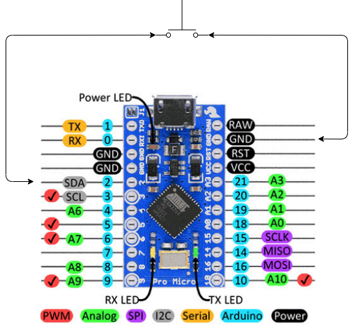

# onebutton
A simple Arduino-based arcade controller. The case is designed in FreeCAD and built using a 3018 pro CNC with 1/8" MDF panels.

# BOM
* [Osoyoo Pro Micro](https://www.amazon.com/gp/product/B012FOV17O/ref=ppx_yo_dt_b_asin_title_o04_s01?ie=UTF8&psc=1)
  * [Datasheet](http://osoyoo.com/2018/06/25/osoyoo-pro-micro-board/)
* [6 Happ Style Buttons](https://www.amazon.com/gp/product/B01MR0E1T6/ref=ppx_yo_dt_b_asin_title_o04_s01?ie=UTF8&psc=1)

# Setup
* Install Windows version Arduino IDE from [arduino.cc](https://www.arduino.cc/en/Main/Software)

## Test Osoyoo Pro Micro
* Connect Osoyoo to the laptop via a micro-USB cable. The card should enumerate with the drivers installed by the Arduino IDE. Verify by opening **Device Manager** and looking under **Ports (COM & LPT)** for **Arduino Micro (COM.)**.
* Open Arduino IDE on PC
* Select **File**-->**Examples**-->**01.Basics**-->**Blink**
* Select **Tools**-->**Board**-->**Arduino/Genuino Micro**
* Select serial port using **Tools**-->**Port:**
* Load code to the board by selecting **Sketch**-->**Upload**
  * Verify the LEDs blink

# Case Assembly

# Building and Loading the Code
* Install Ardunio **Keyboard** library using **Sketch**-->**Include Library**-->**Manage Libraries**
* Open driver/driver.ino sketch
* Load code to the board by selecting **Sketch**-->**Upload**

# References
* [Arduino Leonardo/Micro As Game Controller/Joystick](https://www.instructables.com/id/Arduino-LeonardoMicro-as-Game-ControllerJoystick/)
* [FreeCAD 0.20 For Beginners](https://www.youtube.com/playlist?list=PLWuyJLVUNtc0UszswD0oD5q4VeWTrK7JC)
